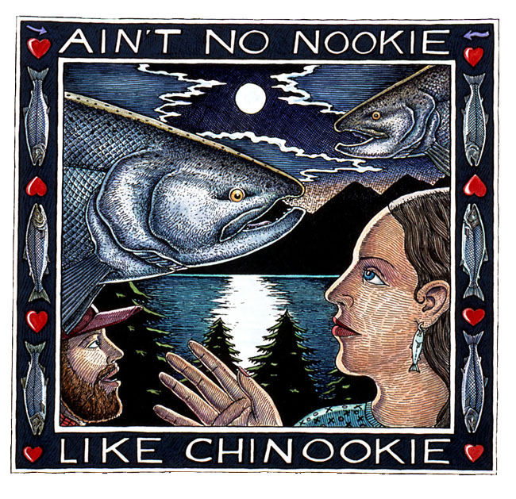

```{r setup, include=FALSE}
knitr::opts_chunk$set(echo = TRUE)
```

```{r}
### Importing data file from knb

catchDF1 = read.csv("https://knb.ecoinformatics.org/knb/d1/mn/v2/object/df35b.302.1", stringsAsFactors = FALSE)
```




```{r}
library(dplyr); library(tidyr)
```

# Basic terminology / verbs in dplyer

```{r}
### Excluding the last two columns from the dataframe

# This notation is the pipe syntax, it does the same thing as the following example
catchDF2 = catchDF1 %>% 
  select(-All, -notesRegCode)

# This is the same as the code above but different syntax...so far, I'm most familiar with this one. 
# select(catch, -All, -notesRegCode)
```

```{r}
#catch %>% select(Region, Year, Chinook,)
```

```{r}
# transposing the data
# the syntax recognizes that the top row is a unique new column title for the transposition, using "species" in this command is renaming the column real-time. Could say "Blah" instead of species, and the new column would be called "Blah"...species was not in the original file or in the metadata. 
catchDF3 = catchDF2 %>%
  gather(species, catch, -Region, -Year)

# checking to make sure have all the species
unique(catchDF3$species)
```

```{r}
# to clean up the errors (there was a catch value of "i"...that's not a number)

catch_integers = as.integer(catchDF3$catch)
which(is.na(catch_integers))
catchDF3[401,"catch"] = 1
catchDF3[401,]
summary(catchDF3)
```

```{r}
# adjust the dataframe so that catch is an integer; cxreated new datafr

catchDF4 = catchDF3 %>%
  mutate(catch = as.integer(catch))

summary(catchDF4)
```

```{r}
# corrected DF to be in realistic units of

catchDF5 = catchDF4 %>%
  mutate(catch = catch * 1000)

summary(catchDF5)
```

```{r}
# get the means of the catch column

catchDF5 %>%
  group_by(Region) %>%
  summarize(mean_catch = mean(catch))
```

```{r}
# total number/sample size within each region

sample_size = catchDF5 %>%
  group_by(Region) %>%
  summarize(n = n())
```

```{r}
# filtering to southern SE catches

sse_catches = catchDF5 %>%
  filter(Region == "SSE")

sse_catches
```

```{r}
# filtering for some kind of stat/selectivity thing

large_catches = catchDF5 %>% 
  filter(catch > 1000000)

summary(large_catches)

```

```{r}
# combining inquiries for filtering

large_sse_catch = catchDF5 %>%
  filter(catch > 1000000 & Region == "SSE")

# Another syntax option that does the same thing to reduce typing code...maybe
#large_sse_catch = catchDF5 %>%
  #filter(catch > 1000000) %>%
  #filter(Region == "SSE")
```

```{r}
large_sse_catch %>%
  arrange(species)

# OR

large_sse_catch %>%
  arrange(catch, species) # the first value is the primary sort, then the secondary sort, etc. 

# OR 

large_sse_catch %>%
  arrange(desc(species)) # this sorts in descending order
```


# Joining datasets together

```{r}
### Importing SECOND data file from knb

region_defs = read.csv("https://knb.ecoinformatics.org/knb/d1/mn/v2/object/df35b.303.1", stringsAsFactors = FALSE)
```

```{r}
# grouping total catch by region...and THEN joining to the second DF

catchDF5 %>%
  group_by(Region) %>%
  summarize(total_catch = sum(catch)) %>%
  left_join(region_defs, by = c("Region" = "code")) # here we are applying a left join to join catchDF5 to region_defs. On the left, first slot is the data on the left, and the "code" is on the right
```

```{r}
# DATES!!! Splitting the month/day/year into separate columns

dates_df <- data.frame(date = c("5/24/1930",
                                "5/25/1930",
                                "5/26/1930",
                                "5/27/1930",
                                "5/28/1930"),
                       stringsAsFactors = FALSE)

dates_df2 = dates_df %>% 
  separate(date, c("month", "day", "year"), "/") # "/" tells the code where to split the numbers in to appropriate columns
```

```{r}
dates_df2 %>%
  unite(date, month, day, year, sep = "/") # to smoosh back the month, day, and year back together
```


